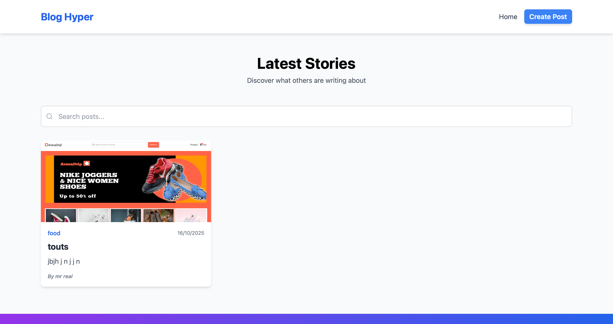

# 📄 Blog Hyper

A modern platform to create, express, and connect — where your words inspire others.

## 🚀 Overview

**Blog Hyper** Share Your Story is a sleek and responsive frontend blog application built with React, Redux Toolkit, Redux Persist, and Tailwind CSS.
It empowers users to create, update, and comment on posts, all within a clean and intuitive interface — perfect for sharing ideas, experiences, and creativity with the world.

---

## ✨ Key Features

- 🖋️ **Create & Edit Posts**  
  Craft beautiful blog posts effortlessly using a simple and distraction-free interface.

- 💬 **Interactive Comments**  
  Engage with stories by adding and viewing comments (frontend simulation).

- ⚡ **State Persistence**  
  User data and posts are preserved between sessions with Redux Persist.

- 🌈 **Responsive Design**
  Built with Tailwind CSS to look and feel great across all screen sizes.

- 🧠 **Scalable Frontend Architecture**
  Ready for future backend integration to support authentication and real data storage.

---

## 🖼 Screenshots

### 🔹 Landing Page

### 🔹 Create & Edit Posts

### 🔹 Blog Feed Overview

---

## 🛠 Built With

- **React + Vite** – Fast, modern frontend framework and build tool.
- **Redux Toolkit** – Centralized and predictable state management.
- **Redux Persist** – Seamless local state persistence.
- **Tailwind CSS** – Elegant, utility-first styling framework.

---